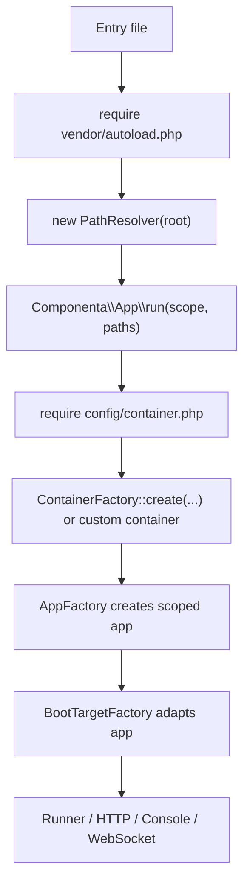

# Componenta App

Application runtime layer for Componenta Framework projects. It coordinates executable entry points, path resolution, project configuration, container creation, cache layout, compile support, scopes, boot targets, and bootloaders.

Use this package in an application skeleton. Reusable runtime libraries should not depend on `componenta/app`; package-specific discovery, compilation, and console integration belongs in separate `*-app` packages.

## Installation

```bash
composer require componenta/app
```

The package declares `Componenta\App\ConfigProvider` in `extra.componenta.config-providers`.
When `componenta/composer-plugin` is installed, that provider is written to the generated provider list automatically.

`Componenta\App\ConfigProvider` registers the base application services, framework bootloaders, and discovery restore/compile helpers. Application skeletons usually do not need to register `DateTimeBootloader`, `ClassDiscoveryBootloader`, `CompiledBootInvocationBootloader`, `BootMethodInvocation`, `BootInvocationCompiler`, or `CompileCache` manually.

## Requirements

- PHP 8.4+
- `componenta/path-resolver`
- `componenta/config`
- `componenta/di`
- runtime packages selected by the application

## Related Packages

| Package | Why it matters here |
|---|---|
| `componenta/path-resolver` | Provides `PathResolver` so entry points resolve project files from the root directory. |
| `componenta/config` | Holds the final application configuration after providers are loaded. |
| `componenta/di` | Builds the service container and invokes factories, runners, handlers, and bootloaders. |
| `componenta/app-http` | Adds HTTP scope, HTTP app adapter, pipeline bootloader, and PSR-7 response emitting. |
| `componenta/app-console` | Adds console scope, Symfony Console integration, and command registration. |
| `componenta/websocket-app` | Adds WebSocket scope and bridges `componenta/websocket-server` into the app boot process. |
| `componenta/router` + `componenta/router-app` | Provide HTTP routing and optional route discovery/cache compilation. |
| `componenta/cqrs` + `componenta/cqrs-app` | Provide command/query execution and optional handler discovery/cache compilation. |

## Application Lifecycle



Every way to run the application has its own entry file:

- `public/index.php` for HTTP;
- `bin/console.php` for CLI;
- a dedicated WebSocket entry point for socket servers.

The common entry shape is intentionally small:

```php
use Componenta\App\Scope;
use Componenta\Stdlib\PathResolver;

use function Componenta\App\run;

$root = dirname(__DIR__);

require $root . '/vendor/autoload.php';

run(Scope::HTTP, new PathResolver($root));
```

There is no required `bootstrap/app.php` and no global project-root constant. The entry point owns the root path, creates `PathResolver`, loads Composer autoload, and passes the selected `Scope` to `Componenta\App\run()`. The function changes the working directory to the project root, loads `config/container.php`, verifies that it returns a PSR-11 container, and delegates execution to `Runner::run()`.

## Container Loading

`config/container.php` is the project composition root. It may call the base factory or return a custom PSR-11-compatible container.

```php
use Componenta\App\ContainerFactory;
use Componenta\App\ContainerFactoryOptions;

return ContainerFactory::create(
    paths: $paths,
    options: new ContainerFactoryOptions(),
);
```

`ContainerFactory::create()` is the default implementation. It receives:

- `PathResolverInterface`;
- assembled `Config`;
- optional discovered classes;
- `ContainerFactoryOptions` for cache behavior.

The factory registers the path resolver in the container and registers the discovered class iterator only when discovery is enabled. Do not pass the concrete mutable container to code that only needs service lookup. If a class only calls `get()`/`has()`, pass `Psr\Container\ContainerInterface`. If it creates fresh objects, pass `FactoryInterface`. If it invokes callables, pass `CallableInvokerInterface`.

## Configuration Lifecycle

`ConfigFactory` hides environment-specific configuration assembly.

Development mode:

- loads the project config definition;
- instantiates configured providers;
- can run class discovery;
- can reuse compile-delta caches;
- can restore attribute-derived config.

Production mode:

- loads compiled config cache directly;
- avoids provider instantiation;
- avoids discovery definition creation;
- avoids repeated filesystem scanning.

The project config definition should stay declarative: it registers config providers and optional discovery directories. Decisions about dev/prod mode, compiled config file, attribute config cache, and discovery cache are framework runtime behavior.

## Cache Layout

`CacheLayout` centralizes project cache paths for:

- compiled config;
- development discovery;
- development compile deltas;
- attribute-derived config;
- DI plans;
- container factory cache;
- route cache;
- policy descriptors;
- interceptor descriptors;
- serializer cache;
- package-specific generated artifacts.

Applications configure cache directories. Generated filenames are framework conventions and should not become application-level options unless deployment really needs that.

## Compile Support

Compile features are optional. App packages contribute compilers only when their runtime package is installed and bound:

| Package | Compiles |
|---|---|
| `componenta/app` | `#[Boot]` method invocation metadata. |
| `componenta/router-app` | Route cache. |
| `componenta/policy-app` | Policy descriptors. |
| `componenta/interceptor-app` | Interceptor descriptors. |
| `componenta/cqrs-app` | Command/query handler maps and command metadata. |
| `componenta/cycle-app` | ORM discovery and console integration. |

`CompileFeatureSupport` keeps optional compilers disabled when the related package binding is missing. The application does not pay compilation cost for packages it does not use.

## AppFactory And Scopes

`AppFactory` creates an application for a requested `Scope` through adapters contributed by runtime integration packages:

- HTTP;
- console;
- WebSocket;
- server.

The base package defines the scope model and adapter contracts. Concrete applications for HTTP, console, and WebSocket scopes are registered by `componenta/app-http`, `componenta/app-console`, and `componenta/websocket-app`.

`ScopedInterface` and `ScopeInterface` come from `componenta/scope` and express which scope an object supports. They are used to fail early when a runner receives an incompatible application object.

## Boot Targets

Runners use adapters around the concrete application object:

- `HttpBootTargetInterface`;
- `ConsoleBootTargetInterface`;
- `WebSocketBootTargetInterface`.

The adapter exposes only the method the runner needs. This keeps framework runners independent from a specific application class without introducing a broad shared target interface that leaks unrelated methods across runtimes.

## Bootloaders

Bootloaders are small startup units executed before the target runs. They receive `BootContext`, not a concrete application object. `BootContext` carries `ContainerValue`, the active scope, and the scope-specific boot target; the merged config is available as `$context->container->config`.

The base package ships framework-level bootloaders for:

- date/time setup;
- class discovery restore/build;
- production execution of compiled `#[Boot]` method invocations.

The package provider adds `DateTimeBootloader`, `ClassDiscoveryBootloader`, and `CompiledBootInvocationBootloader` to `ConfigKey::BOOTLOADERS`. It also registers `BootMethodInvocation` as a development-only `class-finder` listener, so classes with boot methods can participate in the application startup flow when discovery is enabled.

HTTP, console, and WebSocket bootloaders live in their integration packages.

If a bootloader needs application-specific behavior, put that behavior behind a small service interface and resolve that service from the container.

## Boot Methods

`#[Boot]` marks a public method that should run during application startup. This is useful for small package or application warmup tasks that belong to a class already discovered by the framework.

```php
namespace App;

use Componenta\App\Boot\Boot;
use Componenta\DI\Attribute\Config;
use Componenta\DI\Attribute\EntryId;

final class Welcome
{
    #[Boot(
        priority: 10,
        params: [
            'service' => new EntryId(AppWarmup::class),
            'name' => new Config('app.name', default: 'Componenta'),
        ],
    )]
    public static function boot(AppWarmup $service, string $name): void
    {
        $service->prepare($name);
    }
}
```

Boot parameters support plain values and the same explicit metadata objects used by DI parameters:

- `EntryId` resolves a service from the container;
- `Config` reads from `Componenta\Config\Config`;
- `Env` reads from `Config::$environment`.

In development, `ClassDiscoveryBootloader` scans classes and `BootMethodInvocation` collects `#[Boot]` methods. When discovery finalizes, `BootInvocationRunner` executes them by descending priority.

During `app:build`, `BootInvocationCompiler` serializes the finalized invocation list into `ConfigKey::BOOT_INVOCATIONS`. In production, `ClassDiscoveryBootloader` skips the development-only listener and `CompiledBootInvocationBootloader` executes only that compiled list when `APP_ENV=production`. This avoids reflection scans and prevents the same boot method from running twice.

`BootInvocationCompiler` does not scan classes or call `finalize()` itself. The common `DiscoveryCompiler` checks before compilation that a finalizable listener supports `FinalizationStateInterface` and is already finalized. The build therefore uses the same discovery lifecycle result prepared by the class-discovery bootloader, without reading private listener state through reflection.

## Discovery Compile Cache

`componenta/app` registers `CompileCache` as a container factory. The factory derives `devCompile` and `devDiscovery` paths from `CacheLayout::fromConfig()`, so `CACHE_DEV_DIR` / `AppConfigKey::CACHE_DEV_DIR` changes are reflected consistently. `ConfigFactory` may read compile-delta caches while building configuration, but the container service itself is owned by this package provider.

## Runtime Integrations

The base package does not contain HTTP, console, or WebSocket runtime implementations:

- `componenta/app-http` creates the HTTP application, loads `config/pipeline.php`, and emits PSR-7 responses;
- `componenta/app-console` creates the Symfony Console application and exposes `ConsoleCommandRegistryInterface`;
- `componenta/websocket-app` creates the WebSocket application scope and loads `config/websocket.php`;
- `componenta/websocket-server` contains the socket server, protocol, connection, and application contracts.

Package-specific CLI commands, HTTP middleware, route discovery, and WebSocket applications should be registered by their focused integration packages.

## Design Boundaries

`componenta/app` is application glue. It may know about entry points, project cache layout, compilation orchestration, and concrete application startup. Runtime libraries should stay usable without application bootstrapping, filesystem discovery, or console registration.
