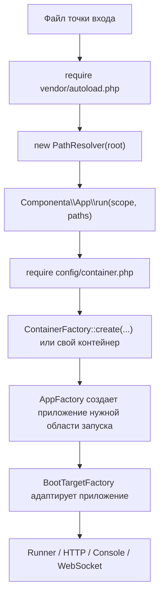

# Componenta App

Прикладной слой времени выполнения для проектов на Componenta Framework. Пакет координирует точки входа, разрешение путей, проектную конфигурацию, создание контейнера, структуру кеша, компиляцию, области запуска, адаптеры запуска и стартовые загрузчики.

Используйте этот пакет в скелете приложения. Переиспользуемые runtime-библиотеки не должны зависеть от `componenta/app`; интеграция конкретного пакета с обнаружением классов, компиляцией, HTTP, консолью или WebSocket должна находиться в отдельном focused app-пакете.

## Граница пакета

`componenta/app` содержит базовую модель приложения: конфигурацию, контейнер, области запуска, boot target adapters, bootloaders и compile support. Он не содержит конкретную HTTP, CLI или WebSocket реализацию.

Конкретные runtime-интеграции подключаются отдельными пакетами:

- `componenta/app-http` создает HTTP-приложение, загружает `config/pipeline.php` и эмитит PSR-7 ответы;
- `componenta/app-console` создает Symfony Console приложение и предоставляет `ConsoleCommandRegistryInterface`;
- `componenta/websocket-app` создает WebSocket-область запуска и загружает `config/websocket.php`;
- `componenta/websocket-server` содержит socket server, protocol, connection и application contracts.

## Установка

```bash
composer require componenta/app
```

Пакет объявляет `Componenta\App\ConfigProvider` в `extra.componenta.config-providers`.
Если установлен `componenta/composer-plugin`, этот провайдер автоматически попадает в сгенерированный список провайдеров.

`Componenta\App\ConfigProvider` регистрирует базовые сервисы приложения, framework bootloaders и вспомогательные сервисы восстановления/компиляции discovery. Скелетам приложения обычно не нужно вручную регистрировать `DateTimeBootloader`, `ClassDiscoveryBootloader`, `CompiledBootInvocationBootloader`, `BootMethodInvocation`, `BootInvocationCompiler` или `CompileCache`.

## Требования

- PHP 8.4+
- `componenta/path-resolver`
- `componenta/config`
- `componenta/di`
- runtime-пакеты, выбранные приложением

## Связанные пакеты

| Пакет | Зачем нужен здесь |
|---|---|
| `componenta/path-resolver` | Дает `PathResolver`, чтобы точки входа разрешали `config/container.php`, кеши и другие файлы относительно корня проекта. |
| `componenta/config` | Хранит итоговую конфигурацию приложения после загрузки провайдеров. |
| `componenta/di` | Создает контейнер сервисов и вызывает фабрики, runners, handlers и bootloaders. |
| `componenta/app-http` | Добавляет HTTP-область запуска, HTTP app adapter, pipeline bootloader и эмиттер PSR-7 ответов. |
| `componenta/app-console` | Добавляет консольную область запуска, интеграцию Symfony Console и регистрацию команд. |
| `componenta/websocket-app` | Добавляет WebSocket-область запуска и связывает `componenta/websocket-server` с boot process приложения. |
| `componenta/router` + `componenta/router-app` | Дают HTTP routing и необязательную компиляцию кеша маршрутов. |
| `componenta/cqrs` + `componenta/cqrs-app` | Дают выполнение команд и запросов, а также необязательное обнаружение и компиляцию карт обработчиков. |

## Жизненный цикл приложения



У каждого способа запуска приложения есть свой файл точки входа:

- `public/index.php` для HTTP;
- `bin/console.php` для CLI;
- отдельный файл для WebSocket-сервера.

Общая форма точки входа намеренно маленькая:

```php
use Componenta\App\Scope;
use Componenta\Stdlib\PathResolver;

use function Componenta\App\run;

$root = dirname(__DIR__);

require $root . '/vendor/autoload.php';

run(Scope::HTTP, new PathResolver($root));
```

Обязательного `bootstrap/app.php` нет. Глобальная константа корня проекта не нужна. Точка входа владеет корневым путем, создает `PathResolver`, подключает Composer autoload и передает выбранный `Scope` в `Componenta\App\run()`. Функция меняет рабочую директорию на корень проекта, загружает `config/container.php`, проверяет, что он вернул PSR-11 контейнер, и делегирует выполнение в `Runner::run()`.

## Загрузка контейнера

`config/container.php` является composition root проекта. Он может вызвать базовую фабрику или вернуть собственный PSR-11-совместимый контейнер.

```php
use Componenta\App\ContainerFactory;
use Componenta\App\ContainerFactoryOptions;

return ContainerFactory::create(
    paths: $paths,
    options: new ContainerFactoryOptions(),
);
```

`ContainerFactory::create()` принимает:

- `PathResolverInterface`;
- собранный `Config`;
- необязательный итератор найденных классов;
- `ContainerFactoryOptions` для поведения кеша.

Фабрика регистрирует resolver путей в контейнере и добавляет итератор найденных классов только когда обнаружение включено.

## Конфигурация

`ConfigFactory` скрывает сборку конфигурации для разных окружений.

Режим разработки:

- загружает проектное определение конфигурации;
- создает настроенные провайдеры;
- может запускать обнаружение классов;
- может переиспользовать compile-delta caches;
- может восстанавливать конфигурацию, полученную из атрибутов.

Production mode:

- загружает скомпилированный config cache напрямую;
- не создает провайдеры повторно;
- не создает discovery definition;
- не сканирует файловую систему повторно.

Проектное определение конфигурации должно оставаться декларативным: оно регистрирует config providers и необязательные discovery directories. Выбор режима, файлов кеша и повторного использования compiled artifacts является поведением framework runtime.

## Структура кеша

`CacheLayout` централизует проектные пути кеша для:

- скомпилированной конфигурации;
- discovery в разработке;
- compile deltas в разработке;
- конфигурации, собранной из атрибутов;
- DI plans;
- container factory cache;
- route cache;
- описания политик;
- описания перехватчиков;
- serializer cache;
- сгенерированных artifacts отдельных пакетов.

Приложение конфигурирует директории кеша. Имена generated files являются соглашениями фреймворка и не должны становиться пользовательскими настройками без реальной причины со стороны deployment.

## Компиляция

Компиляция опциональна. App-пакеты добавляют compilers только когда соответствующий runtime package установлен и связан:

| Пакет | Что компилирует |
|---|---|
| `componenta/app` | Метаданные вызовов `#[Boot]` методов. |
| `componenta/router-app` | Route cache. |
| `componenta/policy-app` | Описания политик. |
| `componenta/interceptor-app` | Описания перехватчиков. |
| `componenta/cqrs-app` | Карты обработчиков команд и запросов, метаданные команд. |
| `componenta/cycle-app` | ORM discovery и console integration. |

`CompileFeatureSupport` держит optional compilers выключенными, если нужная service binding отсутствует. Приложение не платит за компиляцию пакетов, которые не использует.

## AppFactory и области запуска

`AppFactory` создает приложение для запрошенного `Scope` через adapters, которые добавляют runtime integration packages:

- HTTP;
- console;
- WebSocket;
- server.

Базовый пакет определяет scope model и adapter contracts. Конкретные приложения для HTTP, console и WebSocket областей регистрируют `componenta/app-http`, `componenta/app-console` и `componenta/websocket-app`.

`ScopedInterface` и `ScopeInterface` поставляются пакетом `componenta/scope` и выражают, какую область запуска поддерживает объект. Они нужны, чтобы runner сразу отклонял несовместимый application object.

## Boot Targets

Runners используют adapters над конкретным объектом приложения:

- `HttpBootTargetInterface`;
- `ConsoleBootTargetInterface`;
- `WebSocketBootTargetInterface`.

Adapter раскрывает только метод, который нужен runner. Так framework runners не зависят от конкретного класса приложения, и при этом не появляется широкий общий интерфейс со всеми методами сразу.

## Bootloaders

Bootloader — небольшая единица запуска, выполняемая до основного приложения. Он получает `BootContext`, а не конкретный application object. `BootContext` содержит `ContainerValue`, текущую область запуска и целевой объект загрузки; собранная конфигурация доступна как `$context->container->config`.

Базовый пакет поставляет framework-level bootloaders для:

- настройки даты и времени;
- восстановления или построения обнаружения классов;
- выполнения скомпилированных `#[Boot]` методов в боевом окружении.

HTTP, console и WebSocket bootloaders находятся в своих integration packages.

Провайдер пакета добавляет `DateTimeBootloader`, `ClassDiscoveryBootloader` и `CompiledBootInvocationBootloader` в `ConfigKey::BOOTLOADERS`. Он также регистрирует `BootMethodInvocation` как слушатель `class-finder` только для разработки и сборки, чтобы классы с boot methods могли участвовать в старте приложения, когда включено discovery.

Если bootloader нуждается в application-specific behavior, вынесите это поведение в небольшой service interface и получите сервис из контейнера.

## Boot-методы

`#[Boot]` помечает публичный метод, который нужно выполнить при старте приложения. Это удобно для небольших задач прогрева или регистрации, которые принадлежат уже обнаруживаемому классу.

```php
namespace App;

use Componenta\App\Boot\Boot;
use Componenta\DI\Attribute\Config;
use Componenta\DI\Attribute\EntryId;

final class Welcome
{
    #[Boot(
        priority: 10,
        params: [
            'service' => new EntryId(AppWarmup::class),
            'name' => new Config('app.name', default: 'Componenta'),
        ],
    )]
    public static function boot(AppWarmup $service, string $name): void
    {
        $service->prepare($name);
    }
}
```

Параметры boot-методов поддерживают обычные значения и явные DI-метаданные:

- `EntryId` получает сервис из контейнера;
- `Config` читает значение из `Componenta\Config\Config`;
- `Env` читает значение из `Config::$environment`.

В режиме разработки `ClassDiscoveryBootloader` сканирует классы, а `BootMethodInvocation` собирает `#[Boot]` методы. При финализации обнаружения `BootInvocationRunner` выполняет их по убыванию `priority`.

Во время `app:build` `BootInvocationCompiler` сериализует финализированный список вызовов в `ConfigKey::BOOT_INVOCATIONS`. В боевом окружении `ClassDiscoveryBootloader` пропускает слушатель только для разработки, а `CompiledBootInvocationBootloader` выполняет только скомпилированный список при `APP_ENV=production`. Так запуск не делает reflection-сканирование и один boot-метод не выполняется дважды.

`BootInvocationCompiler` не сканирует классы и не вызывает `finalize()` самостоятельно. Общий `DiscoveryCompiler` перед компиляцией проверяет, что финализируемый слушатель поддерживает `FinalizationStateInterface` и уже финализирован. Поэтому сборка использует тот же результат discovery lifecycle, который был подготовлен загрузчиком классов, без доступа к приватному состоянию слушателя через reflection.

## Discovery Compile Cache

`componenta/app` регистрирует `CompileCache` как фабрику контейнера. Фабрика берет `devCompile` и `devDiscovery` из `CacheLayout::fromConfig()`, поэтому изменения `CACHE_DEV_DIR` / `AppConfigKey::CACHE_DEV_DIR` применяются последовательно. `ConfigFactory` может читать compile-delta cache во время сборки конфигурации, но сам сервис контейнера принадлежит провайдеру этого пакета.

## Границы

`componenta/app` — прикладная склейка. Он может знать о точках входа, структуре проектного кеша, координации компиляции и запуске конкретного приложения. Runtime-библиотеки должны оставаться пригодными для использования без application bootstrapping, filesystem discovery и console registration.
